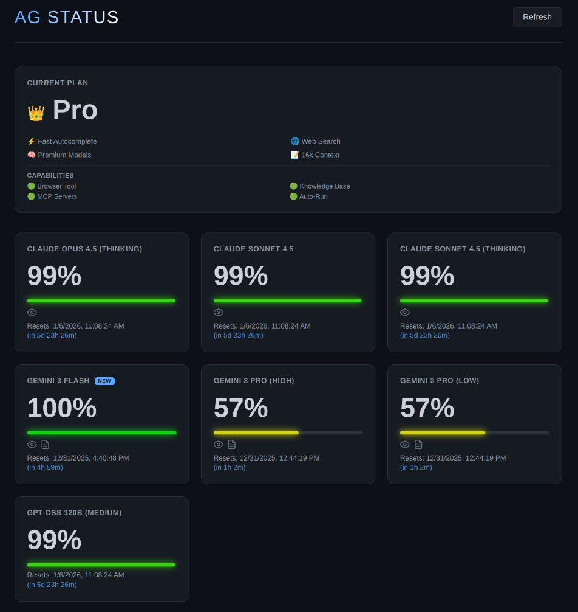
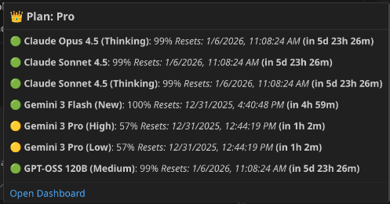

# Personal AntiGravity Usage Extension 🚀

A highly customized, premium dashboard for tracking your AntiGravity usage, quotas, and plan capabilities directly within Google's AntiGravity.

## Features ✨

### 📊 Real-Time Dashboard
*   **Live Quota Tracking**: Visual bars showing exact remaining percentage for all models (Claude, Gemini, GPT).
*   **Smart Resets**: Counts down to the exact second of your quota reset (e.g., "in 5d 12h 43m").
*   **Traffic Light Colors**: 
    *   🟢 **Good**: > 50%
    *   🟡 **Caution**: < 50%
    *   🟠 **Low**: < 30%
    *   🔴 **Critical**: < 10%

### 👑 Plan Intelligence
*   **Current Plan Card**: Displays your active plan (e.g., "Pro") and verifies features:
    *   ⚡ Fast Autocomplete
    *   🌐 Web Search
    *   🧠 Premium Models
    *   📝 Context Window Size (e.g. 16k)
*   **Capabilities Panel**: Instantly see if "Power Features" are enabled:
    *   🟢 Browser Tool
    *   🟢 Knowledge Base
    *   🟢 Auto-Run Commands
    *   🟢 MCP Servers

### 🌟 Skills & Recommendations
*   **Skills Badges**: Icons indicate what each model can do:
    *   👁️ **Vision**: Supports Images
    *   📝 **Docs**: Supports PDFs/Text
    *   🎤 **Audio**: Supports Voice
    *   📹 **Video**: Supports Video Input
*   **New/Beta Tags**: Automatically highlights "NEW" models with a badge.

### 🔔 Smart Alerts
The extension passively monitors your usage and sends native VS Code notifications:
*   **Reset Alert**: Notifies you when a model's quota resets to 100%.
*   **Low Quota Warning**: Warns you when a model drops below 10% critical levels.

### 🔎 Status Bar Integration
*   **Clean Status**: Shows `$(crown) Pro` in your status bar.
*   **Rich Tooltip**: Hover to see a snapshot of all quotas without opening the dashboard.

## Installation 📦

1.  Download the `.vsix` release.
2.  In VS Code, go to **Extensions** -> **...** -> **Install from VSIX...**.
3.  Select the file and reload the window.

## Usage
*   Click the **Status Bar Item** (`👑 Pro`) to open the dashboard.
*   Run command `Personal AG Usage: Show Dashboard` from the Command Palette.
*   The dashboard auto-refreshes every 60 seconds (or immediately when you switch back to the tab).

## License
MIT
